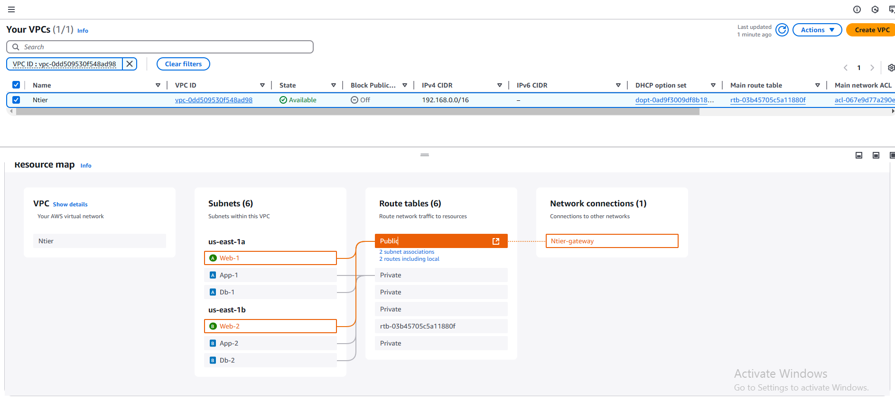

### Project : Creation of an EC2 in Aws using Terraform Script (N-Tier Architecture)

---

_Prerequisites_

- You must have an Account on <b>AWS cloud Platform</b>
- Ensure you have account on `AWS` Cli
- Ensure You have installed `Terraform` and `Visual 
studio` along with Terraform extension on your local system.

---

<i>Once you have installed all the required tools on your system then you can start building an script</i>

---

### Steps Required to create an Ec2 instance

1. **Login into your [AWS Management Console](https://aws.amazon.com/console/)**

   - Log in with your AWS credentials.

2. **Navigate to EC2 and lauch an ec2 instace.**
3. **Configure Instance Settings**

   - **Name and Tags**:  
     Assign a name to your instance (e.g., "MyEC2Instance").

   - **Application and OS Images (AMI)**:  
     Select an Amazon Machine Image (AMI), such as Amazon Linux, Ubuntu, or Windows Server.

   - **Instance Type**:  
     Choose the instance type (e.g., `t2.micro` for free tier eligibility).

   - **Key Pair (Login)**:

     - Select an existing key pair or create a new one.
     - Download the private key file (`.pem`) if creating a new key pair.

   - **Network Settings**:

     - Choose a VPC and subnet
     - Enable a public IP address if the instance needs internet access.
     - Configure Security Group Rules:
       - Allow SSH (port 22) for Linux or RDP (port 3389) for Windows.
       - Add HTTP/HTTPS rules if hosting a web server.

   - **Storage**:  
     Specify the volume size and type (default is 8GB General Purpose SSD for free tier).

---

---

### Using Terraform Script :-

---

     I have designed and deployed a custom network infrastructure on AWS using Terraform scripts, which included setting up a Virtual Private Cloud (VPC), subnets, routes, route tables, network gateways, and security groups to support EC2 instances.

---

**N-tier-Application**
**Step 1: providers.tf**

The `providers.tf` file specifies the AWS provider, including its source and version. This tells Terraform which provider to use when managing AWS resources.

**Step 2: network.tf**

In `network.tf` file I have write an script for my own vpc (vitual Private Cloud) , Subnet (public and private subnet), Route table (Public and Private), Association of Route table to subnets (Public and Private) , Internet gateway, and Lastly ive added Route to the Internate Gateway for Communicating with outside world.

---

**Step 3. variables.tf**
In `varibles.tf` I have Initialize All the values of an componets of ec2 instance, so that i can change them at runtime.

---

---

**Step 4. Default.tfvars**

Ive passed all variables values in `default.tfvars`
By doing this i can achive infrastructure code more flexible, reusable, and maintainable.

---

**Step 5 : Securitygrp.tf**
The `Securitygrp.tf` for traffic managing including Ingress rule and egress rules.

---

**Step 6 : instance.tf**
In `instance.tf` ive provided the ami image,key,security grp required for my instance to create

---

**Step 7 : output.tf**

Outputs can provide essential information, such as  URLs, IP addresses, or credentials, that are needed to  interact with the deployed infrastructure.

---
 

### To Run Terraform Script

```bash
  terraform init
  terraform validate
  terraform apply -var-file="default.tfvars"
```

This will create an Infrasture of Your EC2 Instance on Your cloud!!!!

----

Follwing Images for N-Tier-Application.





---

- You can delete the infra by following 
```bash
 terraform destroy -var-file="default.tfvars"
```
Ive Successfully Completed My Project for  N-Tier-Application Using Terraform Script..

**Happy Learning!!! 😊**
---


